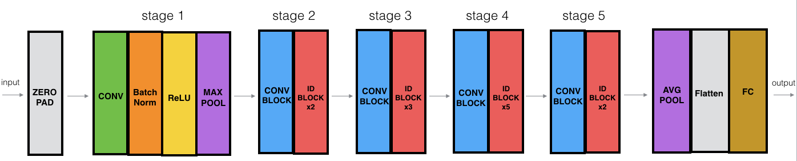

# Residual Networks
## Problem of very Deep Neural Nets
- The main benefit of a very deep network is that it can represent very complex functions. It can also learn features at many different levels of abstraction, from edges (at the shallower layers, closer to the input) to very complex features (at the deeper layers, closer to the output).
- However, using a deeper network doesn't always help. A huge barrier to training them is vanishing gradients: very deep networks often have a gradient signal that goes to zero quickly, thus making gradient descent prohibitively slow.
- More specifically, during gradient descent, as you backprop from the final layer back to the first layer, you are multiplying by the weight matrix on each step, and thus the gradient can decrease exponentially quickly to zero (or, in rare cases, grow exponentially quickly and "explode" to take very large values).
- During training, you might therefore see the magnitude (or norm) of the gradient for the shallower layers decrease to zero very rapidly as training proceeds:

In ResNets, a "shortcut" or a "skip connection" allows the gradient to be directly backpropagated to earlier layers

The image on the left shows the "main path" through the network. The image on the right adds a shortcut to the main path. By stacking these ResNet blocks on top of each other, you can form a very deep network.

It is also known to be proven that having ResNet blocks with the shortcut also makes it very easy for one of the blocks to learn an identity function. This means that you can stack on additional ResNet blocks with little risk of harming training set performance. (There is also some evidence that the ease of learning an identity function--even more than skip connections helping with vanishing gradients--accounts for ResNets' remarkable performance.)

Two main types of blocks are used in a ResNet, depending mainly on whether the input/output dimensions are same or different.

## The Identity Block 
The identity block is the standard block used in ResNets, and corresponds to the case where the input activation has the same dimension as the output activation. To flush out the different steps of what happens in a ResNet's identity block, here is an alternative diagram showing the individual steps:

Here're the individual steps.

First component of main path:

- The first CONV2D has $F_1$ filters of shape (1,1) and a stride of (1,1). Its padding is "valid" and its name should be conv_name_base + '2a'. Use 0 as the seed for the random initialization.
- The first BatchNorm is normalizing the channels axis. Its name should be bn_name_base + '2a'.
- Then apply the ReLU activation function. This has no name and no hyperparameters.

Second component of main path:

- The second CONV2D has $F_2$ filters of shape $(f,f)$ and a stride of (1,1). Its padding is "same" and its name should be conv_name_base + '2b'. Use 0 as the seed for the random initialization.
- The second BatchNorm is normalizing the channels axis. Its name should be bn_name_base + '2b'.
- Then apply the ReLU activation function. This has no name and no hyperparameters.

Third component of main path:

- The third CONV2D has $F_3$ filters of shape (1,1) and a stride of (1,1). Its padding is "valid" and its name should be conv_name_base + '2c'. Use 0 as the seed for the random initialization.
- The third BatchNorm is normalizing the channels axis. Its name should be bn_name_base + '2c'. Note that there is no ReLU activation function in this component.

Final step:

- The shortcut and the input are added together.
- Then apply the ReLU activation function. This has no name and no hyperparameters.

## The Convolutional Block
The ResNet "convolutional block" is the other type of block. You can use this type of block when the input and output dimensions don't match up. The difference with the identity block is that there is a CONV2D layer in the shortcut path:

The CONV2D layer in the shortcut path is used to resize the input $x$ to a different dimension, so that the dimensions match up in the final addition needed to add the shortcut value back to the main path. (This plays a similar role as the matrix $W_s$ discussed in lecture.) For example, to reduce the activation dimensions's height and width by a factor of 2, you can use a 1x1 convolution with a stride of 2. The CONV2D layer on the shortcut path does not use any non-linear activation function. Its main role is to just apply a (learned) linear function that reduces the dimension of the input, so that the dimensions match up for the later addition step.

The details of the convolutional block are as follows.

First component of main path:

- The first CONV2D has $F_1$ filters of shape (1,1) and a stride of (s,s). Its padding is "valid" and its name should be conv_name_base + '2a'.
- The first BatchNorm is normalizing the channels axis. Its name should be bn_name_base + '2a'.
- Then apply the ReLU activation function. This has no name and no hyperparameters.

Second component of main path:

- The second CONV2D has $F_2$ filters of (f,f) and a stride of (1,1). Its padding is "same" and it's name should be conv_name_base + '2b'.
- The second BatchNorm is normalizing the channels axis. Its name should be bn_name_base + '2b'.
- Then apply the ReLU activation function. This has no name and no hyperparameters.

Third component of main path:

- The third CONV2D has $F_3$ filters of (1,1) and a stride of (1,1). Its padding is "valid" and it's name should be conv_name_base + '2c'.
- The third BatchNorm is normalizing the channels axis. Its name should be bn_name_base + '2c'. Note that there is no ReLU activation function in this component.

Shortcut path:

- The CONV2D has $F_3$ filters of shape (1,1) and a stride of (s,s). Its padding is "valid" and its name should be conv_name_base + '1'.
- The BatchNorm is normalizing the channels axis. Its name should be bn_name_base + '1'.

Final step:

- The shortcut and the main path values are added together.
- Then apply the ReLU activation function. This has no name and no hyperparameters.

## Building the ResNet Model(50 Layers)
We now have the necessary blocks to build a very deep ResNet. The following figure describes in detail the architecture of this neural network. "ID BLOCK" in the diagram stands for "Identity block," and "ID BLOCK x3" means you should stack 3 identity blocks together.

The details of this ResNet-50 model are:

Zero-padding pads the input with a pad of (3,3)

Stage 1:
- The 2D Convolution has 64 filters of shape (7,7) and uses a stride of (2,2). Its name is "conv1".
- BatchNorm is applied to the channels axis of the input.
- MaxPooling uses a (3,3) window and a (2,2) stride.

Stage 2:
- The convolutional block uses three set of filters of size [64,64,256], "f" is 3, "s" is 1 and the block is "a".
- The 2 identity blocks use three set of filters of size [64,64,256], "f" is 3 and the blocks are "b" and "c".

Stage 3:
- The convolutional block uses three set of filters of size [128,128,512], "f" is 3, "s" is 2 and the block is "a".
- The 3 identity blocks use three set of filters of size [128,128,512], "f" is 3 and the blocks are "b", "c" and "d".

Stage 4:
- The convolutional block uses three set of filters of size [256, 256, 1024], "f" is 3, "s" is 2 and the block is "a".
- The 5 identity blocks use three set of filters of size [256, 256, 1024], "f" is 3 and the blocks are "b", "c", "d", "e" and "f".

Stage 5:
- The convolutional block uses three set of filters of size [512, 512, 2048], "f" is 3, "s" is 2 and the block is "a".
- The 2 identity blocks use three set of filters of size [256, 256, 2048], "f" is 3 and the blocks are "b" and "c".
- The 2D Average Pooling uses a window of shape (2,2) and its name is "avg_pool".
- The flatten doesn't have any hyperparameters or name.
- The Fully Connected (Dense) layer reduces its input to the number of classes using a softmax activation. Its name should be 'fc' + str(classes)
